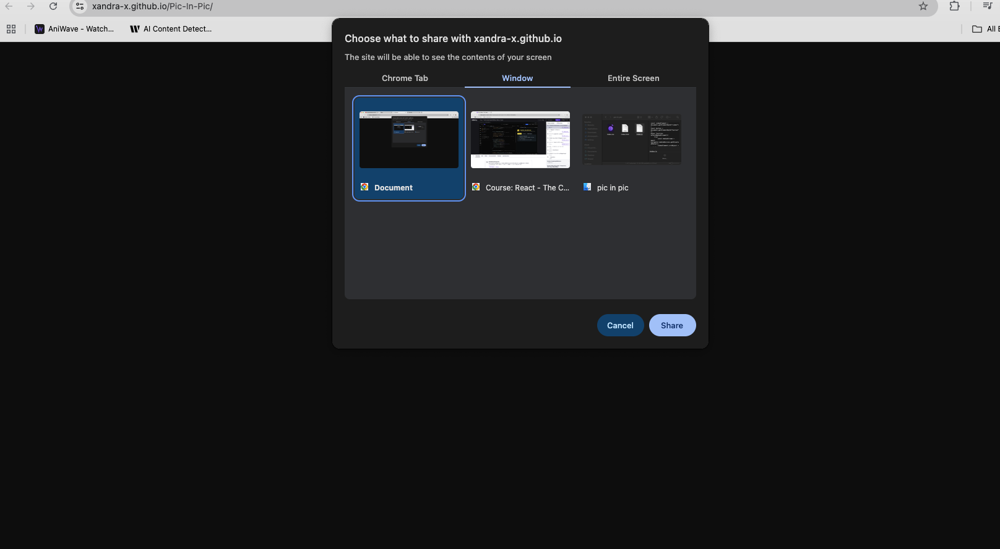

# 📺 Project Name — Web Demo Template

> A short one-line summary of what your project does.



## 🌐 Live Demo

👉 [Click here to try the demo](https://xandra-x.github.io/Pic-In-Pic/)

## 📜 Description

This is a lightweight web application built with vanilla HTML, CSS, and JavaScript. It demonstrates a key browser feature or interaction — perfect for learning, experimenting, or showing off a concept.

## 🚀 Features

- 🎯 Key Feature #1 (e.g., Screen capture with `getDisplayMedia`)
- 🖼️ Key Feature #2 (e.g., Picture-in-Picture mode)
- 🧠 Minimal dependencies, clean structure
- 📱 Fully responsive UI
- 💅 Styled with Pure CSS 

## 🧰 Tech Stack

- **HTML5**
- **CSS3**
- **JavaScript (ES6+)**

Clone the repo:
   ```bash
   https://xandra-x.github.io/Pic-In-Pic/
   cd Pic-In-Pic

